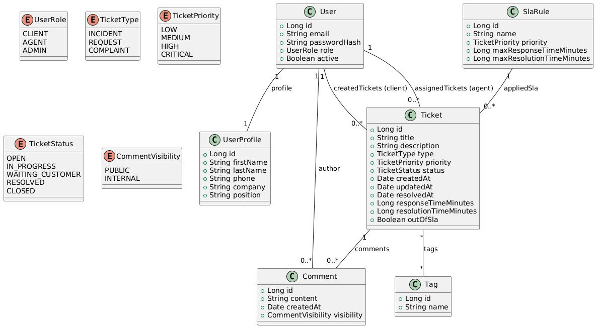

# HelpDeskPro – API REST de Gestion des Tickets Support

## 1. Présentation générale

HelpDeskPro est une API RESTful destinée à la gestion complète d’un système de support client.  
Elle permet de centraliser les demandes, organiser leur traitement, automatiser l’assignation des tickets et analyser la performance du service.

Ce projet est réalisé dans le cadre de la SAE « Développement & Déploiement d’une Application Web RESTful Conteneurisée » et met en œuvre :

- Java et Spring Boot  
- PostgreSQL  
- Spring Data JPA / Hibernate  
- Conteneurisation via Docker et Docker Compose  
- Conception et documentation d’une API REST structurée  

---

## 2. Objectifs fonctionnels

### 2.1 Gestion des utilisateurs et rôles

L’application gère trois catégories d’utilisateurs :

- **Client** : création et suivi des tickets  
- **Agent** : traitement des tickets  
- **Administrateur** : gestion de la plateforme  

Chaque utilisateur possède un **profil personnel** (nom, prénom, coordonnées), géré dans une entité séparée pour une meilleure structuration des données.

### 2.2 Gestion des tickets

Chaque ticket contient :

- Titre, description  
- Type, priorité, statut  
- Dates clé (création, mise à jour, résolution)  
- Client émetteur  
- Agent assigné  

Fonctionnalités supportées :

- Création de ticket  
- Mise à jour de statut  
- Assignation ou réassignation d’un agent  
- Ajout de commentaires (internes ou visibles par le client)  
- Recherche et filtrage multi-critères  

### 2.3 Gestion des SLA (Service Level Agreement)

HelpDeskPro permet d’associer à chaque priorité une règle SLA définissant les délais de réponse et de résolution.  
Le système calcule automatiquement :

- Le temps de réponse  
- Le temps total de traitement  
- Le respect ou dépassement du SLA  

### 2.4 Statistiques

Endpoints dédiés pour :

- Nombre de tickets par statut  
- Charge de travail par agent  
- Temps moyen de résolution  
- Tickets hors SLA  

---

## 3. Modélisation des données

HelpDeskPro implémente les relations exigées dans la SAE :

### Relation One-to-One  
`User` ↔ `UserProfile`  
Séparation des données d’authentification et du profil utilisateur.

### Relation One-to-Many  
`Ticket` → `Comment`  
Un ticket peut contenir plusieurs commentaires.

### Relation Many-to-Many  
`Ticket` ↔ `Tag`  
Les tickets peuvent être associés à plusieurs catégories.

### Relations supplémentaires  
- `Ticket` → `Client` (Many-to-One)  
- `Ticket` → `Agent` (Many-to-One)  

---

## 4. Architecture technique

### Technologies utilisées

- Java   
- Spring Boot (Web, Validation, Data JPA)  
- Hibernate  
- PostgreSQL  
- Swagger / OpenAPI  
- JUnit  
- Docker et Docker Compose  

### Organisation en couches

- **Controllers** : exposition des endpoints REST  
- **Services** : logique métier, workflow des statuts et SLA  
- **Repositories** : accès aux données via JPA  
- **Entities** : modèle métier et mapping ORM  
- **Configuration** : documentation, base de données, sécurité éventuelle  

---

## 5. Endpoints principaux

### Utilisateurs
- POST /api/users
- GET /api/users/{id}
- GET /api/users?role=AGENT
### Tickets
- POST /api/tickets
- GET /api/tickets
- GET /api/tickets/{id}
- PATCH /api/tickets/{id}/assign
- PATCH /api/tickets/{id}/status
### Commentaires
- POST /api/tickets/{id}/comments
### Tags
- POST /api/tags
- POST /api/tickets/{ticketId}/tags/{tagId}
### Statistiques
- GET /api/stats/tickets-by-status
- GET /api/stats/tickets-by-agent
- GET /api/stats/average-resolution-time
- GET /api/stats/out-of-sla

---

## Diagramme de classes
Le diagramme de classes est le suivant :

